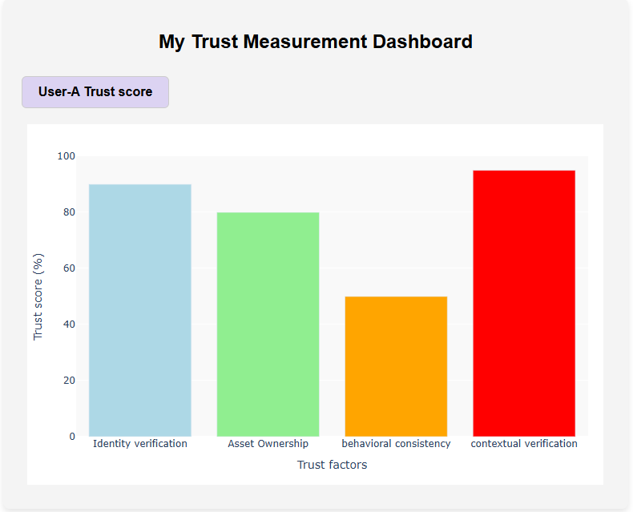
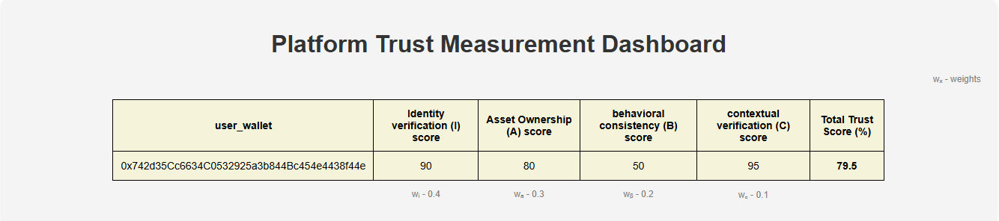

# trusted-metaverse
This repo is designed and structured for a research study on measuring trust within and across virtual worlds within the metaverse ecosystem.

The source code / artifact is meant for the researcher to instantiate to measure the trust elements of virtual worlds. The plaform owner (organization who owns the virtual world) and the end user who uses the virtual world can measure the trust elements. These measurements will help the platform to establish and improve security capabilities within the platform

**This is the user view**

**This is the platform view**
